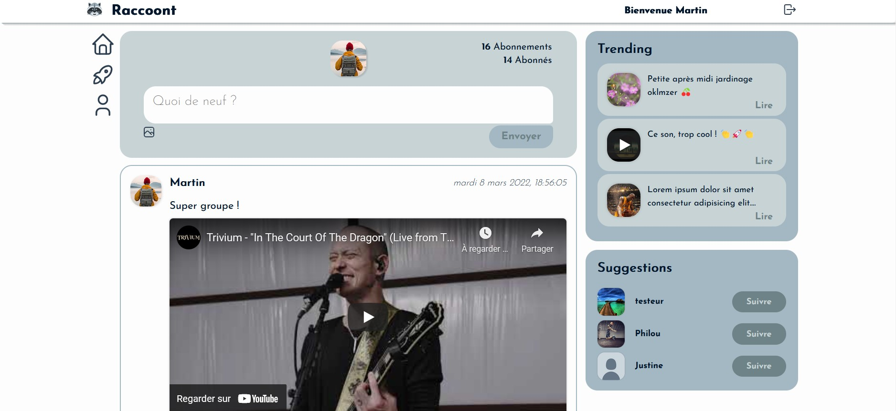

# Projet Raccoont

Modification du projet réalisé par JustFS (https://github.com/JustFS/mern-project).

---

## MERN Stack

### React / Express / MongoDB / Redux

Démarrer le server : `npm start`

Démarrer le front : `cd client` + `npm start`

---

### Modifications apportées

-   Changement de la charte graphique
-   Mise à jour du projet sous Node.js 16.14.0
-   Utilisation de Multer pour l'upload des images côté back : modification du post.controller, routes et ajout de middlewares
-   Adaptation de l'upload côté front : ajout d'actions redux et adaptation du component associé

---

